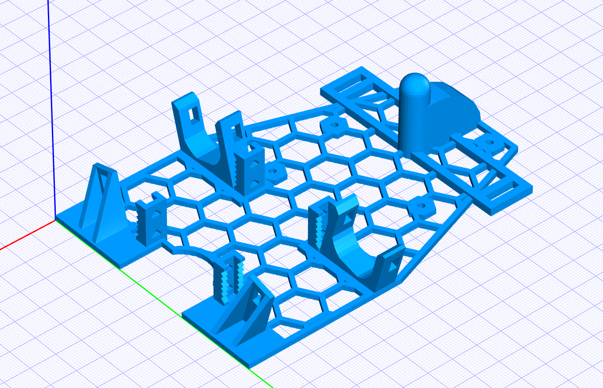
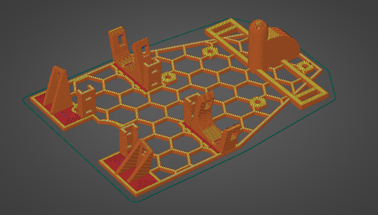
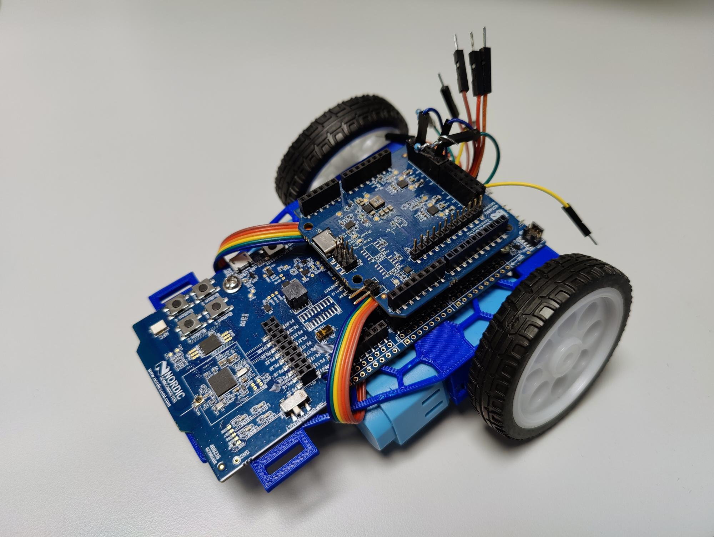
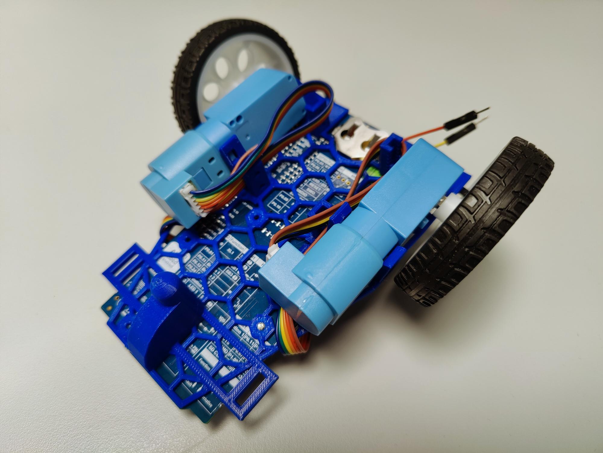

# Robot War Body

This is the source for the Robot War body that allows to mount two motors to a
Development kit.

## Source

The model was developed using [JSCAD](https://github.com/jscad/JSCAD.org), it
can be viewed in the browser
[here](https://nordicplayground.github.io/robot-war-body/).

### Set up

    npm ci

### Running

    npm start

## Sliced model

- [Step file](./artifacts/robot-body.stl)
- [Prusa Slicer Project](./artifacts/robot-body.3mf), configured for
  [Creality CR-10 Smart](https://www.creality.com/products/creality-cr-10-smart-3d-printer)
- [GCode for Creality CR-10 Smart](./artifacts/robot-body_3h37m_0.20mm_210C_PLA_CR10SMART.gcode)

## Printed and assembled robot

